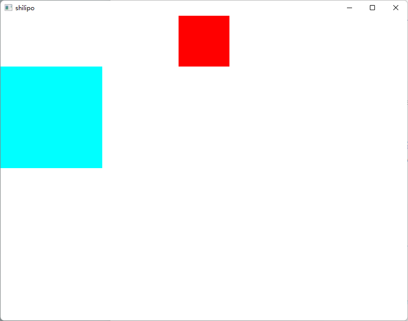

# Shilipo

Try to build a tiny toy browser? 

> "What I cannot create, I do not understand" — Richard Feynman

## Current Progress

- [x] Simple html parser and naive dom tree
- [x] Simple css parser for tiny subset of the css specs
- [x] Naive style node tree, mixing dom and cssom node
- [x] Naive layout engine
- [x] Naive paint engine
- [x] Naive graphics output
- [ ] Network infrastructure
- [ ] Javascript engine

Or maybe more?

## Demo Snapshot

```html
<!DOCTYPE html SYSTEM "about:legacy-compat">
<html>
  <head>
    <meta charset="utf-8" />
    <title>github.com</title>
  </head>
  <body>
    <div class="a"></div>
    <div class="b"></div>
  </body>
</html>
```

```css
.a {
    width: 100px;
    height: 50px;
    margin: auto;
    background: #FF0000;
}

.b {
    width: 200px;
    margin-left: 0;
    margin-right: auto;
    height: 100px;
    background: #00FFFF;
}
```



## Acknowledgement & References

1. Mainly inspired by [mbrubeck/robinson](https://github.com/mbrubeck/robinson) project
2. [HTML Semantics](https://html.spec.whatwg.org/multipage/dom.html#semantics-2)
3. [CSS Syntax](https://www.w3.org/TR/css-syntax-3/)
4. [Servo](https://github.com/servo/servo)